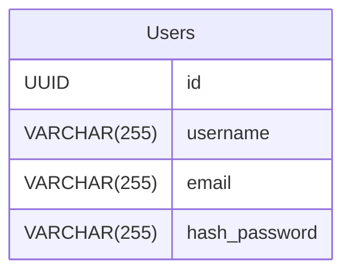

# To-kAy-Do

## Описание

To-kAy-Do - учебный проект из серии "начальные проекты backend-разработчика".
Представляет из себя To-Do List.

## Цель проекта

- Освоить FastAPI и базовую backend разработку.
- Отработать работу с двумя базами данных и реализовать CRUD-операции.
- Разобраться с JWT-авторизацией.
- Разобраться с Docker-ом.

## Технологический стек

Backend:
- Язык программирования: Python 3.13
- Фреймворк: FastAPI
- Базы данных: 
    - MongoDB - хранение задач,
    - PostgreSQL - хранение информации о пользователе.

Frontend:
- HTML, CSS, JS, Bootstrap 5 + Jinja


## Запуск

1. Клонируем данный репозиторий
2. Переходим в него
3. Создаем виртуальное окружение `python -m venv .venv`
4. Активируем виртуальное окружение (смотрите, как это сделать под вашу ОС)
5. Устанавливаем зависимости `pip install -r requirements.txt`


uvicorn src.backend.main:app --reload

## Схема баз данных

### PostgreSQL:

### Структура

#### Users

| Name              | Type         | Settings        | References | Note |
| ----------------- | ------------ | --------------- | ---------- | ---- |
| **id**            | UUID         | 🔑 PK, not null|            |      |
| **username**      | VARCHAR(255) |  not null, unique|            |      |
| **email**         | VARCHAR(255) |  not null, unique|            |      |
| **hash_password** | VARCHAR(255) | not null        |            |      | 

#### Diagram



### MongoDB

### Структура

#### Tasks

```
{
    "_id": "ObjectId",
    "user_id": "UUID (ref: Users.id)",
    "title": "string",
    "description": "string",
    "created_at": "ISO 8601",
    "completed_at": "ISO 8601 | null",
    "completed": "bool"
}
```


## API


### Auth

**Регистрация пользователя**

`POST /api/auth/register`


**_Входные данные - json_**

```json
{
    "username": ...,
    "email": ...,
    "password": ...
}
```

**_Выходные данные - json_**

201 Created - Пользователь создан
```json
{
    "detail": "Пользователь успешно создан!"
}
```

409 Conflict - Пользователь существует
```json
{
    "detail": "Пользователь с таким username/email уже существует"
}
```

429 Too Many Requests - Пользователь отправил слишком много запросов
```json
{
    "detail": "Слишком много запросов! Пожалуйста повторите позже"
}
```

500 Internal Server Error - Ошибка на стороне сервера
```json
{
    "detail": "Internal Server Error"
}
```


**Выдача JWT**

`POST /api/auth/login`


**_Входные данные - json_**

```json
{
    "username": ...,
    "password": ...
}
```

**_Выходные данные - json_**

200 OK - Запрос успешно обработан
```json
{
    "access_token": ...,
    "type": "Bearer"
}
```

401 Unauthorized - Неаутентифицированный пользователь
```json
{
    "detail": "Пользователь неутентифицирован"
}
```

401 Unauthorized - Пользователь ввел неверный пароль
```json
{
    "detail": "Логин или пароль не совпадают"
}
```

429 Too Many Requests - Пользователь отправил слишком много запросов
```json
{
    "detail": "Слишком много запросов! Пожалуйста повторите позже"
}
```

500 Internal Server Error - Ошибка на стороне сервера
```json
{
    "detail": "Internal Server Error"
}
```

### Tasks

**Создать задачу**

`POST /api/tasks`


**_Входные данные_**

json
```json
{
    "title": ...,
    "description": ...
}
```
Header
```
Authorization: Bearer <token>
```

**_Выходные данные - json_**

201 Created - Задача успешно создана
```json
{
    "detail": "Задача была успешно создана"
}
```

429 Too Many Requests - Пользователь отправил слишком много запросов
```json
{
    "detail": "Слишком много запросов! Пожалуйста повторите позже"
}
```

500 Internal Server Error - Ошибка на стороне сервера
```json
{
    "detail": "Internal Server Error"
}
```

**Получить все задачи**

`GET /api/tasks`

**_Параметры запроса_:**
- completed
- created_at
- completed_at


**_Входные данные_**

Header
```
Authorization: Bearer <token>
```

**_Выходные данные - json_**

200 OK - Запрос успешно обработан
```json
[
    {
        "id": ...,
        "user_id": ...,
        "title": ...,
        "description": ...,
        "created_at": ...,
        "completed_at": ...,
        "completed": ...
    }
    ...
]
```

429 Too Many Requests - Пользователь отправил слишком много запросов
```json
{
    "detail": "Слишком много запросов! Пожалуйста повторите позже"
}
```

500 Internal Server Error - Ошибка на стороне сервера
```json
{
    "detail": "Internal Server Error"
}
```

**Получить одну задачу**

`GET /api/tasks/{id}`

`id - ObjectID` - ID задачи


**_Входные данные_**

Path parameters

`id - ObjectID` - ID задачи

Header
```
Authorization: Bearer <token>
```

**_Выходные данные - json_**

200 OK - Запрос успешно обработан
```json
{
    "id": ...,
    "user_id": ...,
    "title": ...,
    "description": ...,
    "created_at": ...,
    "completed_at": ...,
    "completed": ...
}
```

404 Not Found - Задача по ID не была найдена
```json
{
    "detail": "Задача не найдена"
}
```

429 Too Many Requests - Пользователь отправил слишком много запросов
```json
{
    "detail": "Слишком много запросов! Пожалуйста повторите позже"
}
```

500 Internal Server Error - Ошибка на стороне сервера
```json
{
    "detail": "Internal Server Error"
}
```

**Обновить задачу**

`PATCH /api/tasks/{id}`

**_Входные данные_**

Path parameters

`id - ObjectID` - ID задачи

json
```json
{
    "title": ... | null,
    "description": ... | null,
    "completed": ... | null
}
```

Header
```
Authorization: Bearer <token>
```


**_Выходные данные - json_**

200 OK - Запрос успешно обработан
json
```json
{
    "completed": true,
    "detail": "Задача завершена"
}
```
Или
```json
{
    "completed": false,
    "detail": "Задача успешно обновлена"
}
```

404 Not Found - Задача по ID не была найдена
```json
{
    "detail": "Задача не найдена"
}
```

500 Internal Server Error - Ошибка на стороне сервера
```json
{
    "detail": "Internal Server Error"
}
```

**Удалить задачу**

`DELETE /api/tasks/{id}`

**_Входные данные_**

Path parameters

`id - ObjectID` - ID задачи

Header
```
Authorization: Bearer <token>
```

**_Выходные данные - json_**

200 OK - Запрос успешно обработан
json
```json
{
    "detail": "Задача удалена"
}
```

404 Not Found - Задача по ID не была найдена
```json
{
    "detail": "Задача не найдена или уже была удалена"
}
```

500 Internal Server Error - Ошибка на стороне сервера
```json
{
    "detail": "Internal Server Error"
}
```